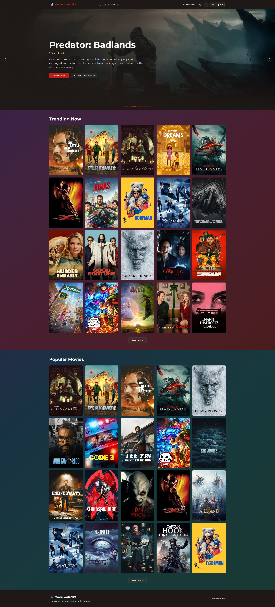
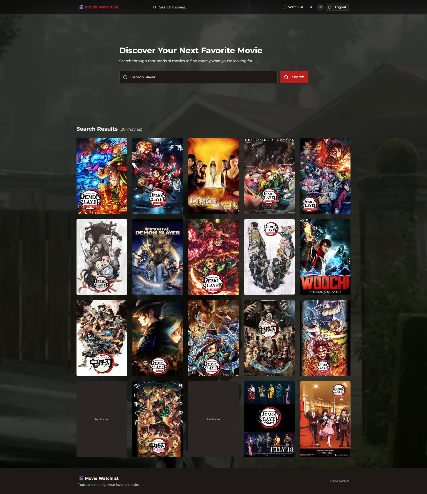
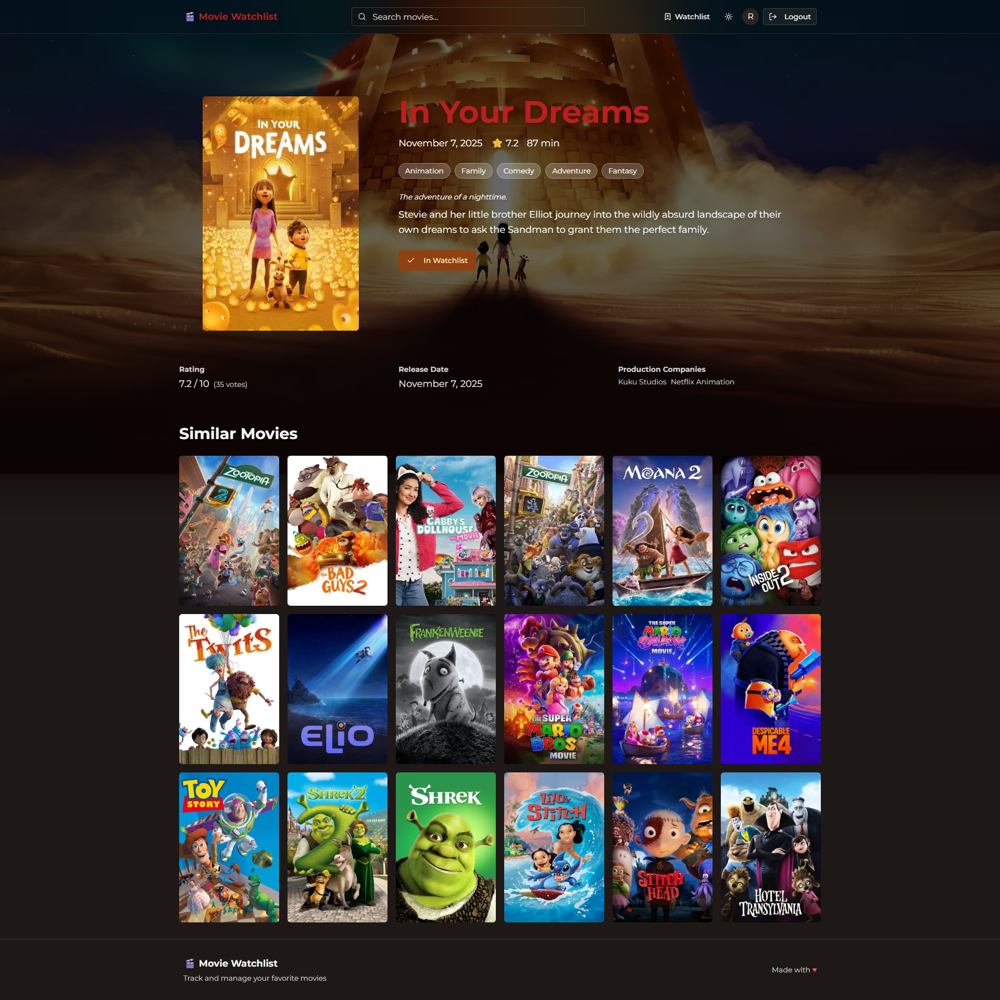
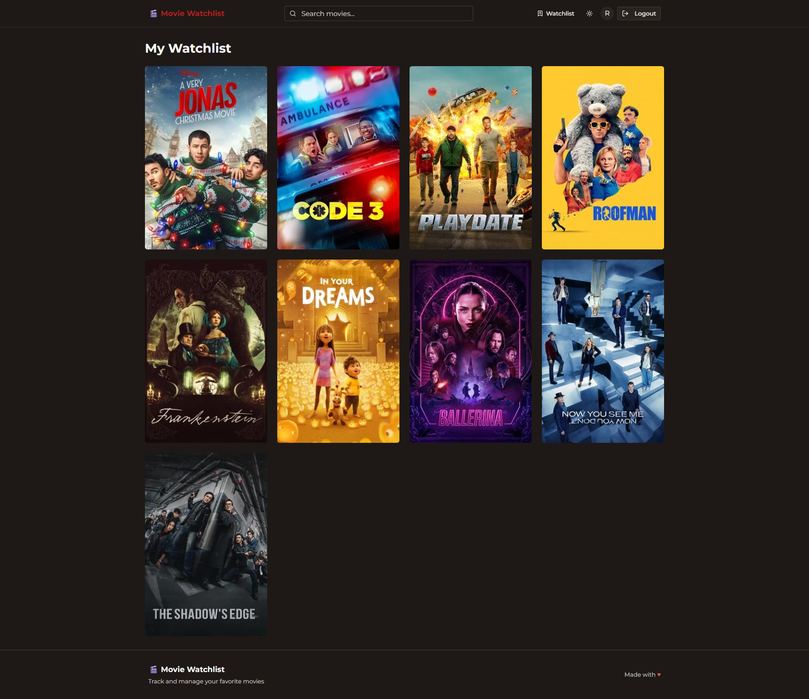
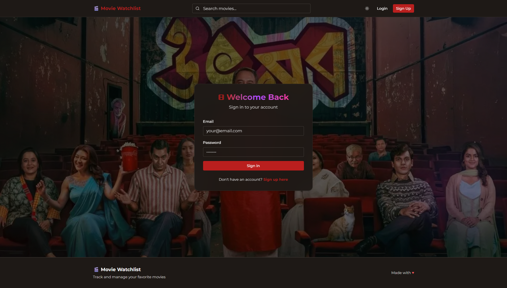
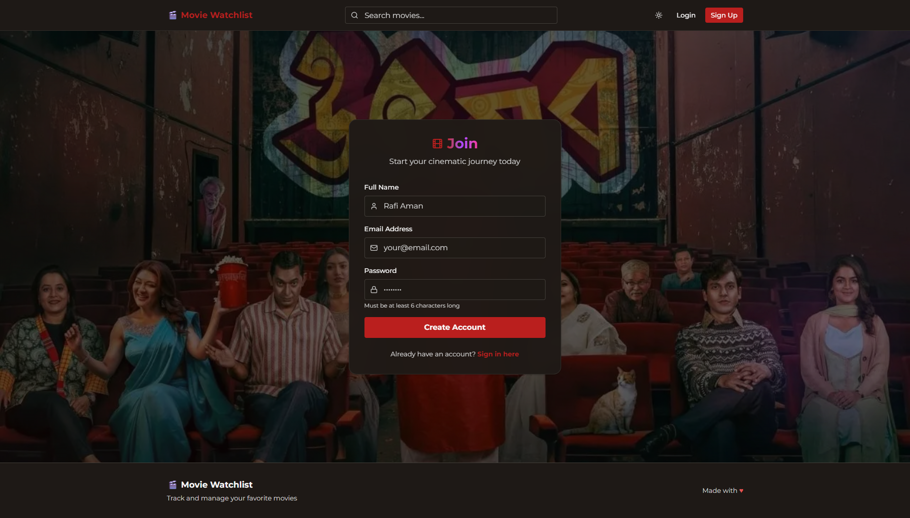

# 🎬 Movie Watchlist

A modern movie watchlist application built with Next.js that allows users to search for movies, manage their watchlist, and track movies they want to watch.

## ✨ Features

- 🔍 Search for movies using an external movie API
- ➕ Add movies to your personal watchlist
- 📱 Responsive design for mobile and desktop
- ⚡ Fast and optimized with Next.js

## 🚀 Getting Started

### Prerequisites

Before you begin, ensure you have the following installed:

- Node.js (version 20 or higher)
- npm, yarn, pnpm, or bun

### Installation

1. Clone the repository:

```bash
git clone https://github.com/rafi-aman3/movie-watchlist.git
cd movie-watchlist
```

2. Install dependencies:

```bash
npm install
# or
yarn install
# or
pnpm install
# or
bun install
```

3. Set up environment variables (if needed):
   Create a `.env.local` file in the root directory and add your API keys:

```env
NEXT_PUBLIC_SUPABASE_URL=your_supabase_url
NEXT_PUBLIC_SUPABASE_ANON_KEY=your_supabase_annon_key
NEXT_PUBLIC_TMDB_TOKEN=your_tmdb_token
```

### Running the Development Server

Start the development server:

```bash
npm run dev
# or
yarn dev
# or
pnpm dev
# or
bun dev
```

Open [http://localhost:3000](http://localhost:3000) in your browser to see the application.

## 🛠️ Built With

- **[Next.js](https://nextjs.org)** - React framework for production
- **[React](https://reactjs.org)** - JavaScript library for building user interfaces
- **[Shadcn/ui](https://ui.shadcn.com)** - Beautifully designed components built with Radix UI and Tailwind CSS

## 📁 Project Structure

```
movie-watchlist/
├── app/                    # Next.js app directory
│   ├── page.js            # Main page component
│   ├── layout.js          # Root layout
│   └── ...
├── components/            # Reusable React components
├── public/               # Static assets
├── styles/              # CSS/styling files
├── .env.local          # Environment variables (not tracked)
├── next.config.js     # Next.js configuration
└── package.json      # Project dependencies
```

## 🎯 Usage

1. **Search for Movies**: Use the search bar to find movies by title
2. **Add to Watchlist**: Click the add button to save movies to your watchlist
3. **Manage Watchlist**: View your saved movies in the watchlist section
4. **Remove Movies**: Delete movies from your watchlist when no longer needed

## 📝 License

This project is open source and available under the [MIT License](LICENSE).

## 👤 Author

**Rafi Aman**

- GitHub: [@rafi-aman3](https://github.com/rafi-aman3)

## 🙏 Acknowledgments

- Movie data provided by [TMDB API](https://www.themoviedb.org/)
- Inspiration from various movie tracking applications

## 📸 Screenshots

### Home Page



### Movie Search



### Movie Details Page



### Watchlist



### Login



### Signup



---

⭐️ If you found this project helpful, please consider giving it a star on GitHub!
